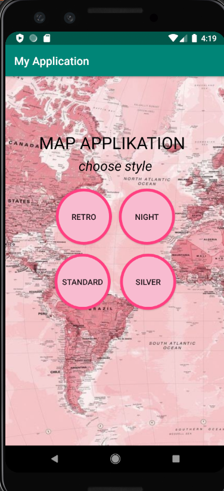
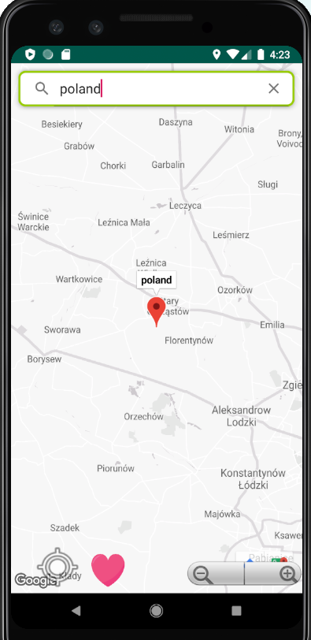
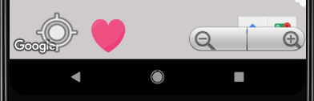
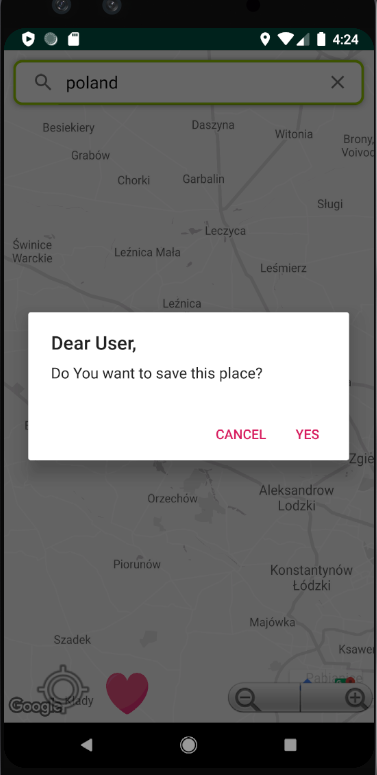
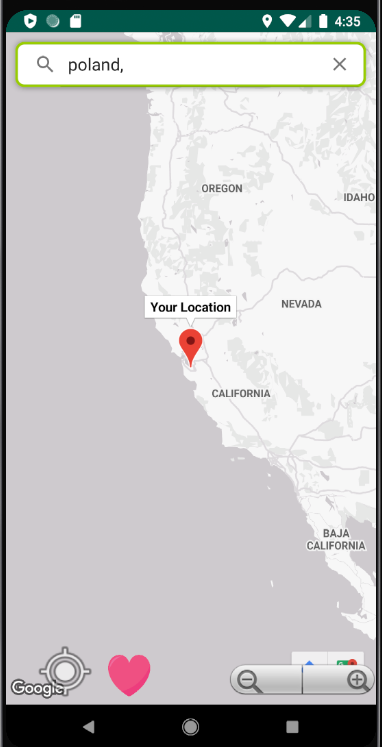
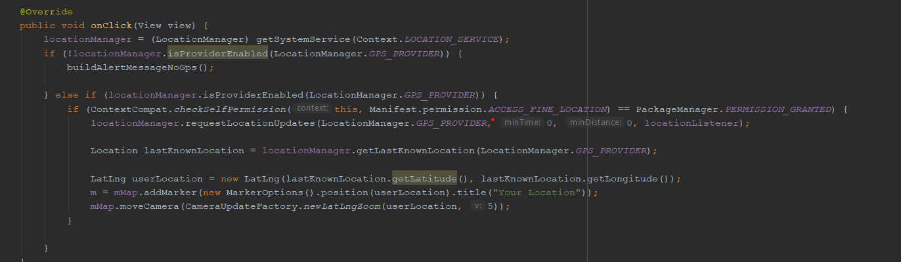
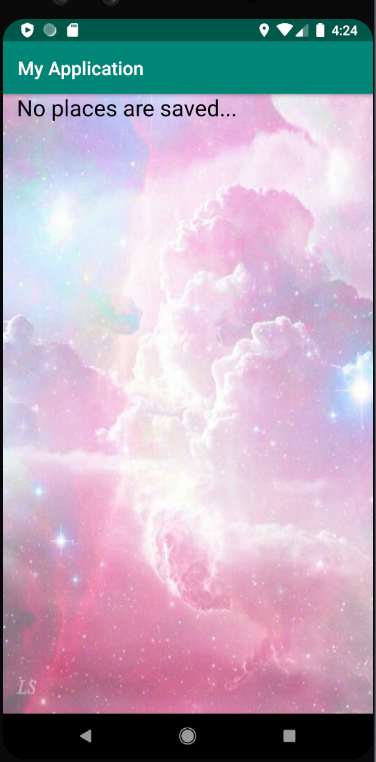

# Android_Maps_app

Po kliknięciu na obrazek w formie serdca, wypisuje aplikacja wszystkie zapisane lokalizacji (Name and location),
w razie gdy nie ma zadnej zapisanej lokalizacji, wypisuje, ze nie ma takich miejsc.

Android_Maps_app
================

Aplikacja pozwala na wybor styla mapy,  wyszukiwanie swojej lokalizacji oraz innych miejsc i zapisu 

Developed By
================

* Alena Arbuzava

Very Important
================

You need to replace the key below with your own key. The example key below will not be accepted because it is not linked to the certificate which you will use to sign this application.

See: <a href="https://developers.google.com/maps/documentation/android/start">Google Developers</a> for instructions on how to get your own key.

App screen shots
================

Na początku mozna wybrac 1 z 4 styli mapy.
> 

Aplikacja posiadająca wyszukiwarkę, ktora znachodzi kraj badz miasto na mapie
> 

Na mapie znajduje sie zoom 
> 

Po kliknięciu na marker wyskakuje okienko, w ktorym mogą Panstwo zapisac to miejsce(Name and location)
> 

Po kliknięciu na ikonkę MY_LOCATION pokazuje aktualną lokalizację telefona na mapie.
> 
część kodu (wyszukiwanie lokalizacji)
> 

w razie niepoprawnego wpisania zwraca komunikat,  "I dont know this place".
> 

